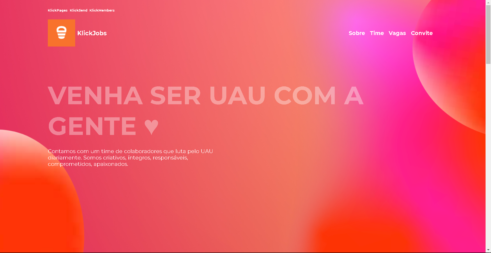

<p align="center"><a href="https://www.ignicaodigital.com.br/" target="_blank" rel="noopener noreferrer"></a></p>
<h1 align="center"> KlickJobs </h1>

<!-- Index session-->
<p align="center">
 <a href="#-sobre-o-projeto">Sobre</a> •
 <a href="#-layout">Layout</a> • 
 <a href="#-funcionalidades">Funcionalidades</a> • 
 <a href="#-tecnologias">Tecnologias</a> • 
 <a href="#-como-executar-o-projeto">Como executar o projeto</a> • 
</p>

<!--About session-->

## 💻 Sobre o projeto

O KlickJobs é novo integrante da família Klick (Members/Pages/Send ) da Ignição Digital. O KlickJobs foi pensado para um melhor "Match" de possíveis candidatos com o time de recrutamento do IGD.

🚧 Aviso: O KlickJobs é um conceito ainda em desenvolvimento 🚧

---

<!--Layout session-->

## 🎨 Layout

<p align="center">
<a href="https://www.figma.com/file/3r6x6rYcaNr3YiRtLHnQXz/IGD-Final?node-id=0%3A1">
  
</a>
</p>
<p align="center"></a></p>

## <!--Functionalities session-->

## ⚙️ Funcionalidades

- [x] Candidatos: podem se submeter a um processo de candidatura simplificada.

  - [x] Nome Completo
  - [x] Email
  - [x] Informações legais sobre o candidato que podem chamar atenção dos recrutadores.
  - [x] Link para seu o currículo, sem complicações!

- [x] RH: maior controle a respeito das vagas e candidatos.

  - [x] Flexibilidade na criação/remoção de vagas por meio de um painel de controle.
  - [x] Facilidade para gerenciar os candidatos interessados por meio de um painel de controle.

---

<!--Tecnologies session-->

## 🛠 Tecnologias

As seguintes ferramentas foram usadas na construção do projeto:

#### **Front-end** ([HTML](https://developer.mozilla.org/pt-BR/docs/Web/HTML) + [CSS](https://developer.mozilla.org/pt-BR/docs/Web/CSS) + [Sass](https://sass-lang.com/) + [JS](https://developer.mozilla.org/pt-BR/docs/Web/JavaScript) + [Vue](https://br.vuejs.org/) + [Vuesax](https://lusaxweb.github.io/vuesax/))

#### **Back-end** ([Strapi](https://strapi.io/))

> Veja o arquivo [package.json](./package.json)

#### **Database** ([PostgreSQL](https://www.postgresql.org/))

#### **Deploy**

- Frontend: **[Vercel](https://vercel.com/)**
- Backend: **[Heroku](https://www.heroku.com/home)**

#### **Utilitários**

- Editor: **[Visual Studio Code](https://code.visualstudio.com/)** → Extensions: **[Vetur](https://marketplace.visualstudio.com/items?itemName=octref.vetur)**
- Layout: **[Figma](https://www.figma.com/)** → **[Layout (KlickJobs)](https://www.figma.com/file/3r6x6rYcaNr3YiRtLHnQXz/IGD-Final?node-id=0%3A1)**

---

<!--Running session-->

## 🚀 Como executar o projeto

Este projeto consiste em três partes:

1. [Frontend](https://github.com/Wiriyamu/klickjobs)
2. [Backend](https://github.com/Wiriyamu/klick-jobs-backend)

<!--Obs-->

### Pré-requisitos

- [Git](https://git-scm.com)
- [Node.js](https://nodejs.org/en/)

#### 🎲 Rodando o projeto - Frontend

```bash

# Clone o repositório
$ git clone

# Acesse a pasta do projeto no prompt de comando

# Instale as dependências
$ yarn

# Execute o script "serve"
$ yarn serve

# O projeto inciará na porta: 8080 - acesse http://localhost:8080

```

---

<!--Bottom session-->
<h4 align=center>Feito com ❤️ por Willian Silva 👋 <a href="https://www.linkedin.com/in/wiriyamu/">Entre em contato :)</a></a></h4>
